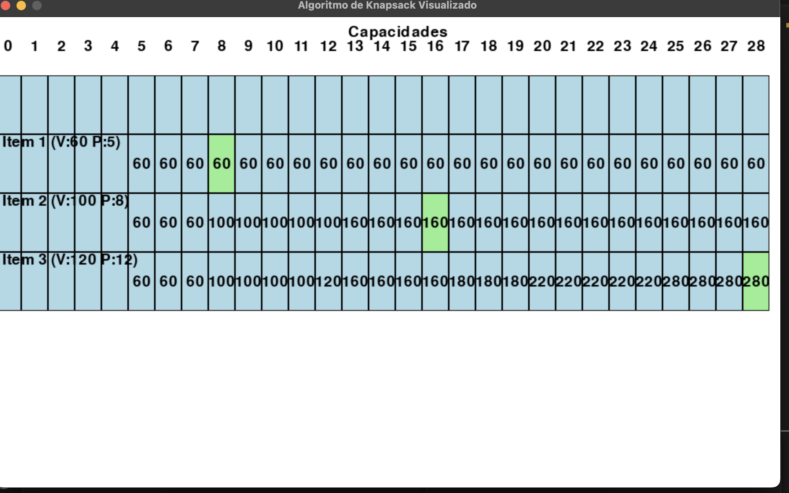
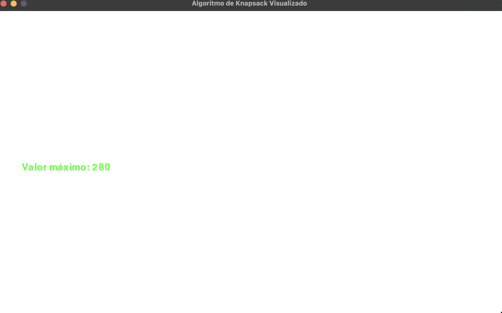

**Número da Lista**: 21 
**Conteúdo da Disciplina**: PD 

## Alunos
|Matrícula | Aluno |
| -- | -- |
| 2O/0038028  | Guilherme Evangelista Ferreira dos Santos|
| xx/xxxxxx  |  xxxx xxxx xxxxx |

## Sobre 
Demonstrar o algoritmo de Kapsnack usando programação dinâmica e pesos indivisiveis 

## Screenshots
Inicio Kapsnack

Montando Memoization

Achando o valor 

## Instalação 
**Linguagem**: Python 
**Framework**: Biblioteca Pygame 
Ter o python instalado juntamente com sua biblioteca pygame.

## Uso 
Aperte o botão para iniciar e a matriz de memoization vai começar a ser formada.

## Outros 
Video https://youtu.be/iTOQk3bN__s

